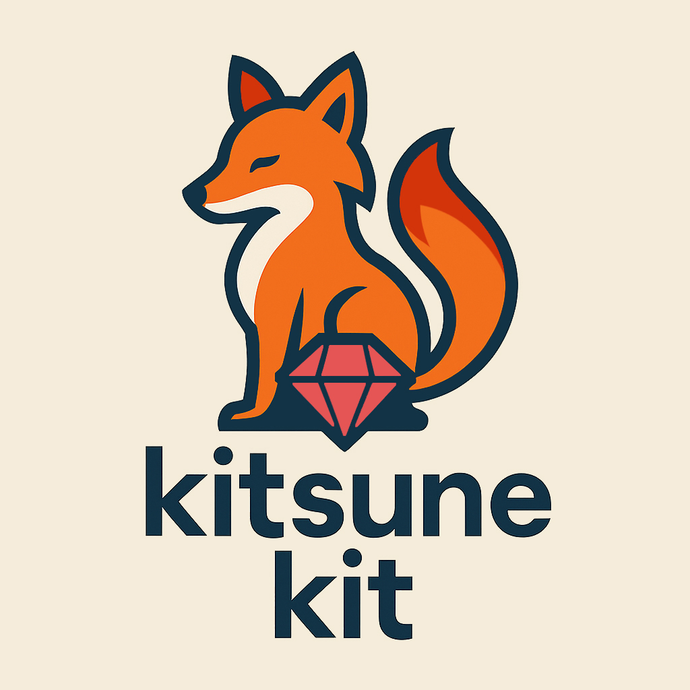

# Kitsune Kit 🦊

<p align="center">
   
</p>

**Kitsune Kit** is a Ruby gem that automates the provisioning, configuration, and setup of remote Linux servers (VPS) to host applications deployed with [Kamal](https://github.com/basecamp/kamal) or Docker Compose. It is designed to work on DigitalOcean infrastructure (for now), featuring reversible commands and a clear workflow.

> 🛠️ *Ideal for Ruby developers who want to launch production without relying on other services.*

---

## 🔍 Main Features

- 🧪 **Automatically provisions** a Droplet on DigitalOcean
- 👤 Configures a secure, passwordless `deploy` user
- 🔐 Applies firewall rules (UFW) for SSH, HTTP, HTTPS
- ♻️ Enables automatic security updates (unattended-upgrades)
- 🐳 Installs and configures Docker Engine and private networking
- 🐘 Deploys PostgreSQL via Docker Compose with healthcheck and `.env`
- 🔄 All steps can be rolled back (`--rollback`)
- ⚡ Fast, reproducible and without relying on YAML or complex external tools

---

## 📦 Installation

Add this line to your `Gemfile`:

```ruby
gem "kitsune-kit"
```

Or install it manually:

```bash
gem install kitsune-kit
```

---

## ⚙️ Prerequisites

1. Configure a DigitalOcean API token:
    ```bash
    export DO_API_TOKEN="your_token"
    ```

2. Have the SSH key ID uploaded to DigitalOcean:
    ```bash
    export SSH_KEY_ID="123456"
    ```

3. Have the private key installed on your local machine:
    ```bash
    export SSH_KEY_PATH="~/.ssh/id_rsa"
    ```

---

## 🚀 Getting Started

Initialize the Kitsune project structure:

```bash
kit init
```

This will create the `.kitsune/` directory, multiple `.env` files, and the necessary Docker templates. Run it in your project's root directory.

---

## 🔧 Main Commands

### 🧱 Server Provisioning

```bash
kit bootstrap execute
```

This creates a Droplet and executes:

1. `setup_user create`
2. `setup_firewall create`
3. `setup_unattended create`

### 🐳 Full Docker Installation

```bash
kit bootstrap_docker execute --server-ip 123.123.123.123
```

This applies in order:

1. `setup_docker_prereqs create`
2. `install_docker_engine create`
3. `postinstall_docker create`

### 🐘 Install PostgreSQL with Docker Compose

```bash
kit setup_postgres_docker create --server-ip 123.123.123.123
```

It will provide you with a `DATABASE_URL` ready for Rails or any other app.

---

## ♻️ Rollback for Each Step

Each command accepts the `--rollback` flag. For example:

```bash
kit bootstrap execute --rollback --keep-server
```

This:
- Reverts the server configuration (`unattended`, `firewall`, `user`)
- Optionally **deletes the Droplet** (if you don't use `--keep-server`)

The same applies to any other subcommand, such as:

```bash
kit bootstrap_docker execute --rollback --server-ip ...
kit setup_postgres_docker rollback --server-ip ...
```

---

## 🌎 Support for Multiple Environments

Use `switch_env` to change between environments:

```bash
kit switch_env to production
```

This updates `.kitsune/kit.env` and creates (if it doesn't exist) `.kitsune/infra.production.env`.

---

## 🔗 Integration with Kamal

Once the server is configured:

1. Define your `kamal.yml` pointing to the created droplet
2. Run `kamal setup` to initialize the deployment
3. Use `kamal deploy` as usual

---

## 💡 Tips

- Use `kit init` in every new project.
- Customize `.kitsune/docker/postgres.yml` if you need additional services.

---

## 📘 Quick Example

```bash
# Initialize project structure
kit init

# Provision Droplet and configure everything
kit bootstrap execute

# Install Docker
kit bootstrap_docker execute --server-ip 123.123.123.123

# Set up the database
kit setup_postgres_docker create --server-ip 123.123.123.123
```

---

## 🧪 In Development

- [ ] Support for other providers (Hetzner)
- [ ] Create databases on another server

---

## 🔐 Security

Never upload your `.env` files to public repositories. Kitsune does not encrypt them: it assumes you control your machine and your repo. Add `.kitsune/` to your project's `.gitignore`.

---

## 📄 License

MIT License © [Omar Herrera / OmarHrra]
